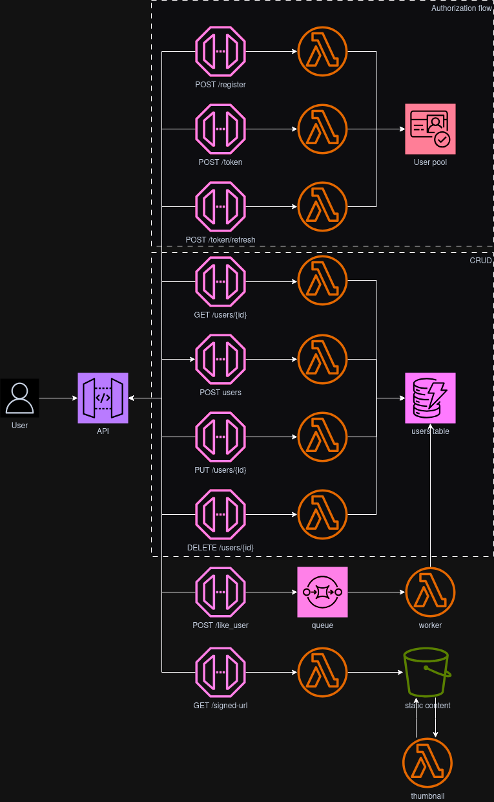

# Serverless CRUD

This repo is for the course project developed along serverless framework course in platzi.

The goal is to achieve the same functionality with slight differences, like using python for all lambda functions, complying with the principle of least privilege, and using Cognito User Pools authorization.

## Architecture

The first course builds the following architecture:


The advanced course extends the former architecture into the following:



## Build

The following commands create the artifact referenced in the serverless.yml to create a lambda layer.

```
pip install -r thumbnail/requirements.txt -d .Python/image_processing/python/
cd .Python/image_processing && zip -r ../image_processing.zip python/* && cd ../..
```

## Deploy

First, install dev dependencies (serverless plugin) in order for the deployment to work with the serverless.yml as is.

```
npm install
```

Then, run deployment with:

```
sls deploy
```

AWS and Serverless dashboard credentials configured (if using serverless v4) are required as well.
